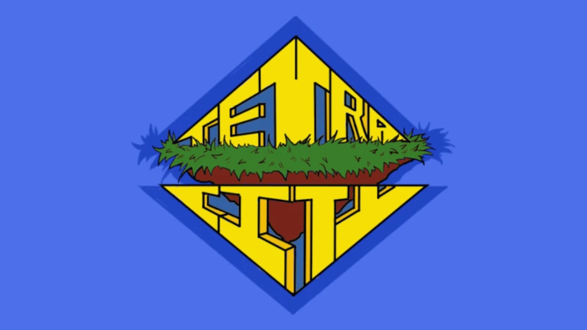

<html lang="en">
    <head>
        <title>Michael Alekseychyk - Home</title>
        <link rel="preload" href="fonts/JetBrainsMono-Bold.woff2" as="font" type="font/woff2" crossorigin="anonymous" data-next-fonts="size-adjust">
        <link rel="preload" href="fonts/JetBrainsMono-Regular.woff2" as="font" type="font/woff2" crossorigin="anonymous" data-next-fonts="size-adjust">
        <link rel="icon" href="images/logo2.svg" type="image/svg+xml">
        <link rel="stylesheet" href="styles.css">
    </head>
    <body>
        <header id="MainHeader">
            

                <a href="/">
                    

                        
                    

                </a>
                <h3 class="HeaderItem">
                    ::HOME::WELCOME
                </h3>
            

            

                <a href="mailto:michaelalekseychyk@gmail.com">
                    

                        
                    

                </a>
                <a href="https://www.linkedin.com/in/mykhaylo-alekseychyk">
                    

                        
                    

                </a>
            

        </header>
        <main id="Main">
            

                

                    

                        

                            <h2 id="MainBodyTitle">
                                Hello!✌️
                            </h2>
                            <h1 id="MainBodyTitle">
                                I'm Mykhaylo "Michael" Alekseychk
                            </h1>
                            

                                I'm a passionate  video game programmer  who likes making and playing games...
                                  
                                ...reimagining Game AI to be more clever, dynamic, and fun.
                            

                        

                        

                            

                                <h2 id="GamesHeader">
                                    Featured Game Projects
                                </h2>
                                Just click on a title to learn more.
                            

                            

                                

                                    <a href="/sleighers" style="text-decoration:none">
                                        

                                            
                                        

                                        <h2 class="CellTitle">
                                            Sleighers
                                        </h2>
                                    </a>
                                    

                                         A festive/anthro-themed  networked multiplayer  first-person shooter.
                                           
                                         Players battle each-other and land grab for their opposing teams, all while avoiding periodic weather events.
                                    

                                    

                                        <h4 class="CellSkill">
                                            C++
                                        </h4>
                                        <h4 class="CellSkill">
                                            Unreal Engine 5
                                        </h4>
                                        <h4 class="CellSkill">
                                            Perforce
                                        </h4>
                                       <h4 class="CellSkill CellSkillBold">
                                            I Led This One!
                                        </h4>
                                    

                                

                                

                                    <a href="/currentcrisis" style="text-decoration:none">
                                        

                                            
                                        

                                        <h2 class="CellTitle">
                                            Current Crisis
                                        </h2>
                                    </a>
                                    

                                         A power grid  construction and management simulator game, sponsored by Sandia National Laboratories.    Players manage a power line system, with an overall goal of mitigating or outright preventing power line failures during natural disasters.
                                    

                                    

                                        <h4 class="CellSkill">
                                            C#
                                        </h4>
                                        <h4 class="CellSkill">
                                            Unity
                                        </h4>
                                        <h4 class="CellSkill">
                                            GitHub
                                        </h4>
                                    

                                

                                

                                    <a href="/tetracity" style="text-decoration:none">
                                        

                                            
                                        

                                        <h2 class="CellTitle">
                                            Tetra City
                                        </h2>
                                    </a>
                                    

                                        A city builder puzzle game whose gameplay is similar to Tetris.    Player must stack buildings in patterns to earn coins, which are used to purchase more buildings, rinse and repeat, with an overall goal of surviving as long as possible.
                                    

                                    

                                        <h4 class="CellSkill">
                                            GDScript
                                        </h4>
                                        <h4 class="CellSkill">
                                            Godot
                                        </h4>
                                        <h4 class="CellSkill">
                                            GitHub
                                        </h4>
                                    

                                

                            

                        

                    

                

            

        </main>
        <footer id="Footer">
            <h5 class="FooterItem">
                This website was made with care by a human!
            </h5>
            <h5 class="FooterItem">
                ©2025 Michael Alekseychyk
            </h5>
        </footer>
    </body>
</html>